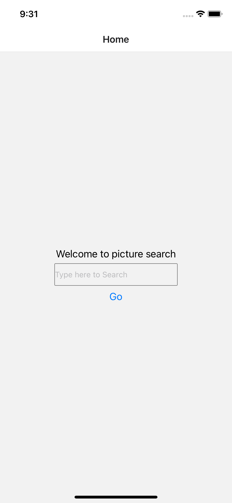
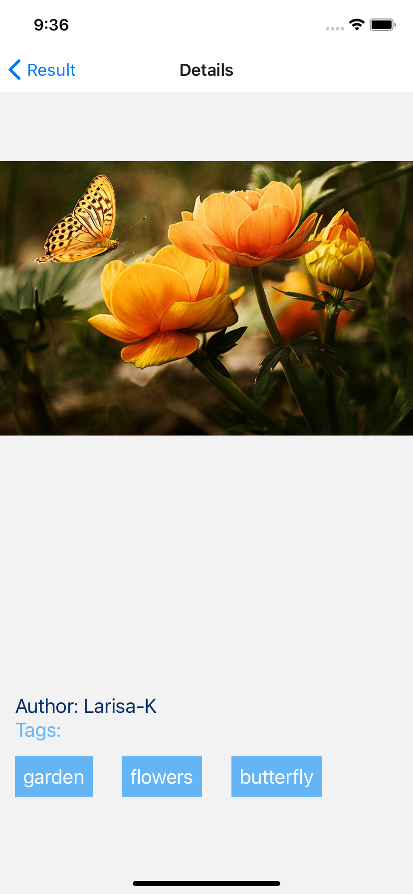

# Picture Search Gallery -- Mobile Application (android, ios, web)
This mobile app was built by myself following the requirements from HOWL. It took about 4-5 hours. The primary focus was on using React Native and Javascript ES6 to dynamically rendering API from pixabay.com. React Hooks was used for state management. And React Navigation was used for three screens. React context API was used for managing global statements in the app.
 <div align=center></div>


# Table of Contents 
  Installing
  Tech-stack
  Components
 

##  1. Installing the app
>*Install Xcode for simulators*
```
install Xcode in the app store
```
>*Open the document*
```
$ cd Howl
```
>*update npm package*
```
$ npm install npm@latest -g
```
>*install expo*
```
$ npm install --global expo-cli
```
>*install watchman*
```
$ brew install watchman
```
>*open expo localhost web page for selecting simulator*
```
$ expo start / npm start
```
>*After the localhost web page for Metro Builder is ran, selecting the simulator or scan the QR code for running on a real mobile phone:*
```
·Run on Android device/emulator
·Run on IOS simulator
·Run in web browser
```


##  2. Tech-stack
      React Native
      React Hook
      React Navigation
      Expo
      React context API
      CSS

##  3. Components
# Search Screen: 
> a search bar for typing keyword
<div align=center> </div>

# Results Screen: 
> an infinite scroll list of image results according to the results of typed keyword
<div align=center> </div>

# Detail Screen: 
> full image with information of author and keyword tags according to the selected picture in the Results Screen
<div align=center></div>


 

